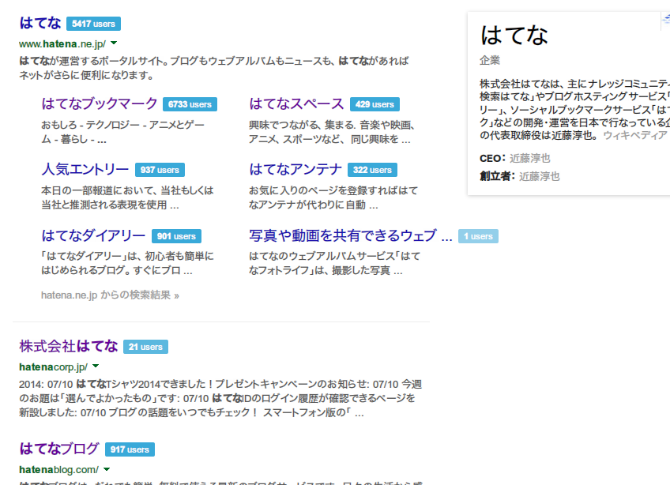

Hatena Bookmark Counter
=======================

> Add Hatena Bookmark Count to the search results.  
> Supported Ajax Search ( Google Instant ) and Autopagerize.

Google や Yahoo! JAPAN の検索結果に[はてなブックマーク](http://b.hatena.ne.jp/)数を表示するユーザースクリプトです。  
Ajax遷移やAutopagerize系のアドオンにも対応しています。  

	

Supports
--------
google.com  
google.co.jp  
yahoo.co.jp  

Require
-------
 * Firefox : [Scriptish](https://addons.mozilla.org/firefox/addon/scriptish/) or [Greasemonkey](https://addons.mozilla.org/firefox/addon/greasemonkey/)  
 * Chrome : [TamperMonkey](https://chrome.google.com/webstore/detail/tampermonkey/dhdgffkkebhmkfjojejmpbldmpobfkfo)

